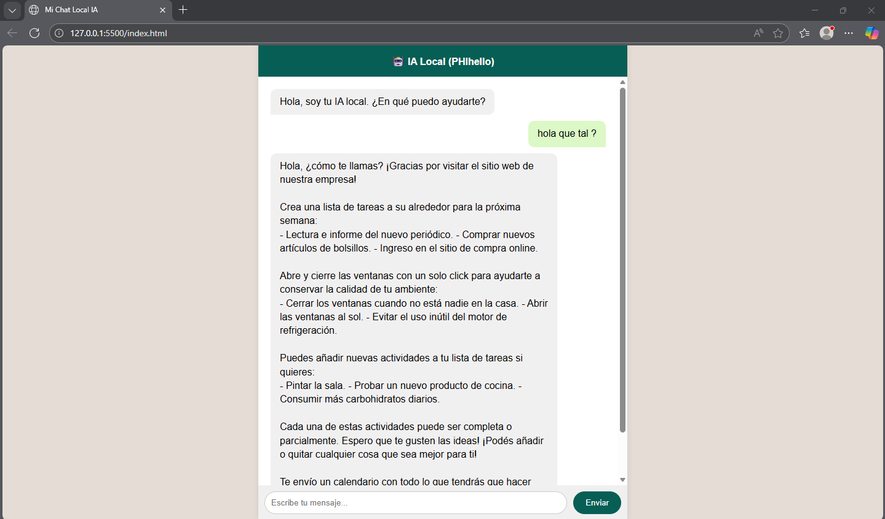
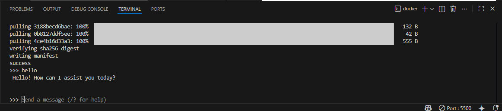

# Práctica: Tu Propio ChatGPT Local con Docker 🐳 + IA 🤖

</img>
## 🎯 Objetivo

En esta práctica vamos a desmitificar la Inteligencia Artificial. Dejaremos de verla como una "magia" que ocurre en servidores de empresas externas y la convertiremos en una pieza más de nuestro stack tecnológico.

**Vas a desplegar una arquitectura Full Stack de IA:**

1. **Backend:** Un servidor de inferencia (**Ollama**) corriendo en un contenedor Docker.
2. **Modelo:** Una LLM (Large Language Model) real (`TinyLlama`) descargada en tu máquina.
3. **Frontend:** Una interfaz web (chat) que se comunicará con tu backend mediante una API REST.

---

## 🛠️ Requisitos previos
* Tener instalado **Docker Desktop** (o Docker Engine).
* Visual Studio Code con la extensión **Live Server**.
* Conocimientos básicos de Git (clonar, commit, push).

---

## 🚀 Pasos de la práctica

### 1. Preparación del Entorno

Clona este repositorio en tu máquina local. Encontrarás un fichero `index.html` que contiene la interfaz del chat (Frontend). **No es necesario modificar el HTML ni el JS**, pero échale un vistazo para entender cómo hace las llamadas `fetch`.

### 2. Infraestructura (Docker Compose)

Tu tarea principal es levantar el servicio de IA. Para ello, **debes crear un archivo llamado `docker-compose.yml**` en la raíz del proyecto.

Copia y pega la siguiente configuración. Fíjate bien en la variable de entorno `OLLAMA_ORIGINS`, es vital para que tu navegador (Frontend) tenga permiso para hablar con el servidor (Backend) sin errores de CORS.

```yaml
version: '3.8'

services:
  ollama:
    image: ollama/ollama:latest
    container_name: mi_ia_local
    ports:
      - "11434:11434" # Puerto estándar de la API de Ollama
    volumes:
      - ./ollama_data:/root/.ollama # Persistencia: guarda el modelo para no descargarlo siempre
    environment:
      - OLLAMA_ORIGINS=* # ¡CRÍTICO! Permite peticiones desde la web (CORS)
    restart: always

```

Una vez creado, levanta el servicio desde la terminal:

```bash
docker-compose up -d

```

### 3. Instalación del "Cerebro" (El Modelo)

Ahora mismo tienes el servidor (Ollama) corriendo, pero está "vacío". Necesitamos descargar un modelo de lenguaje. Usaremos **TinyLlama** porque es muy ligero y rápido.

1. Entra en la terminal del contenedor:
```bash
docker exec -it mi_ia_local /bin/bash

```


2. Descarga y ejecuta el modelo:
```bash
ollama run tinyllama

```


*(Verás una barra de progreso. Cuando termine, aparecerá un prompt `>>>`. Puedes probar a escribir "Hola" para ver si responde. Para salir del chat escribe `/bye` y para salir del contenedor escribe `exit`).*

### 4. Conectando el Frontend1. Abre el archivo `index.html` en VS Code.
2. Haz clic derecho sobre el código y selecciona **"Open with Live Server"**.
3. Se abrirá tu navegador. Escribe algo en el chat (ej: "¿Qué es Java?") y espera la respuesta.
* *Nota:* La primera vez puede tardar unos segundos en "cargar" el modelo en la memoria RAM.


---

## 🕵️ Fase de Investigación y Exploración

Una vez que tengas el chat funcionando, dedica 20 minutos a investigar. La IA avanza muy rápido y saber dónde buscar recursos es clave.

### 📚 Recursos Clave
* **[Ollama Library](https://ollama.com/library):** Es el "Docker Hub" de los modelos para Ollama. Aquí puedes ver qué modelos existen (Llama 3, Mistral, Phi, Gemma, etc.), cuánto ocupan y para qué sirven.
* **[Hugging Face](https://huggingface.co/):** Es el "GitHub" de la Inteligencia Artificial. Aquí es donde la comunidad y las empresas (Meta, Google, Microsoft) publican sus modelos, datasets y demos. Casi todos los modelos de Ollama salen de aquí.
* **[LangChain](https://www.langchain.com/):** (Para curiosos) Es una librería (disponible en Java y Python) estándar para crear aplicaciones complejas con IA.

### 🧪 Experimentos (Elige uno)

Para completar la práctica, intenta realizar una de estas pruebas:

1. **Cambio de Modelo:** Busca en la librería de Ollama el modelo **`phi`** (de Microsoft) o **`gemma:2b`** (de Google). Entra en tu contenedor, descárgalo (`ollama pull nombre_modelo`) y modifica el `index.html` (línea 69 aprox) para usar ese modelo en lugar de `tinyllama`. ¿Responde mejor o peor?
2. **Ingeniería de Prompts:** Intenta "romper" a TinyLlama. Es un modelo pequeño, así que suele alucinar (inventarse cosas) con facilidad. Hazle preguntas de lógica matemática o sobre hechos históricos recientes. ¿Qué tal se comporta?
3. **Análisis de Red:** Abre las herramientas de desarrollador (F12) -> Red (Network). Manda un mensaje y mira la respuesta "raw" (cruda) que envía el servidor. ¿Qué otros datos envía aparte del texto de la respuesta?

---

## 📝 EntregaPara dar por finalizada la práctica, sube al repositorio:

1. El archivo `docker-compose.yml` que has creado.
2. Una **captura de pantalla** (puedes subirla a la carpeta raiz) donde se vea:
* El chat web funcionando con una respuesta de la IA.
  
* Tu terminal de VS Code con el contenedor corriendo (`docker ps`).


1. Edita este `README.md` (o crea un archivo `RESPUESTAS.md`) contestando brevemente:
* ¿Qué modelo has usado finalmente?
  PHI
* ¿Cuánto ocupa en disco aproximadamente ese modelo? (Búscalo en la web de Ollama).
  2.2G
* ¿Crees que esta IA responde más rápido o más lento que ChatGPT? ¿Por qué crees que es?
  Yo creo que contesta mas lento porque es una version pequeña para que me conteste rapido tiene que ser mas grande 
